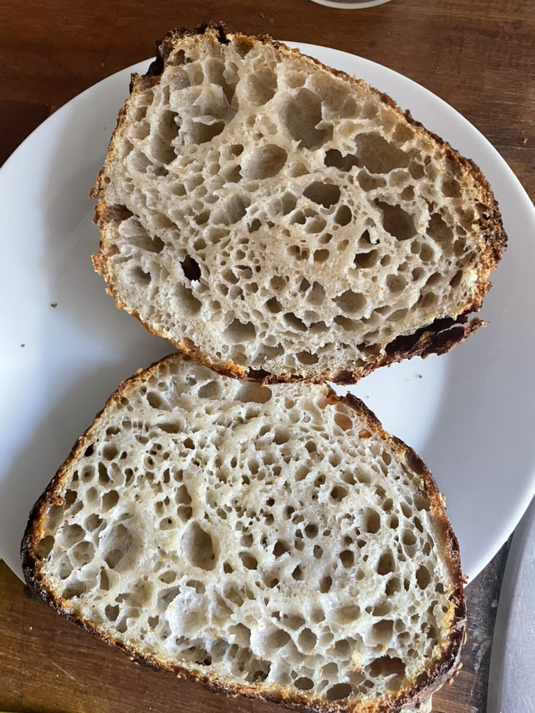
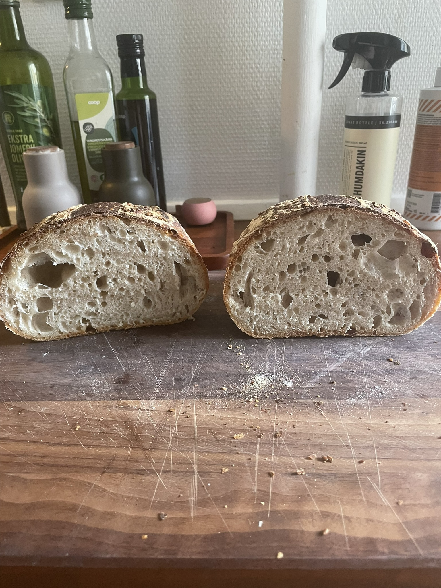

# Sourdough Bread/Buns

Recipe for sourdough buns or bread. Creates a 900g boule or ~ 9 sourdough buns.

## Ingredients

| **Ingredient**                                          | **Weight** | **Baker’s Percentage** |
| ------------------------------------------------------- | ---------- | ---------------------- |
| bread flour (~12.0-14.0% protein)                       | 426 g      | 90,00 %                |
| Whole wheat flour (~12.0-14.0% protein, Ølandshvedemel) | 47 g       | 10,00 %                |
| Water 1                                                 | 331 g      | 70,00 %                |
| Water 2                                                 | 48 g       | 10,00 %                |
| Salt                                                    | 9 g        | 1,80 %                 |
| Ripe sourdough starter (100% hydration)                 | 30 g       | 6,40 %                 |

_**Total yield: 900 g**_

## Steps

| **Step**             | **Hour**      | **Description**                                                                    |
| -------------------- | ------------- | ---------------------------------------------------------------------------------- |
| 1. Levain            | 00:00         | Mix starter levain (50% starter. 50% flour/water.                                  |
| 2. Autolyse          | 03:00         | Mix bread flour + whole wheat flour + water 1 in Ankarsrum (4 min low /w roller).  |
| 3. Mix               | 05:00         | Mix autolyse with starter, salt, and 20-70% of water 2 depending on structure (10 min on medium w/ roller)          |
| 4. Bulk Fermentation | 05:15 - 09:15 | 3 sets of stretch and folds from 05:30-06:30. Then rest for 3 hours.               |
| 5. Preshape          | 09:15         | Shape into a tight ball.                                                           |
| 6. Shape/Store       | 09:45         | Shape into boule and store in bread basket or store in oiled bowl. Place in fridge |
